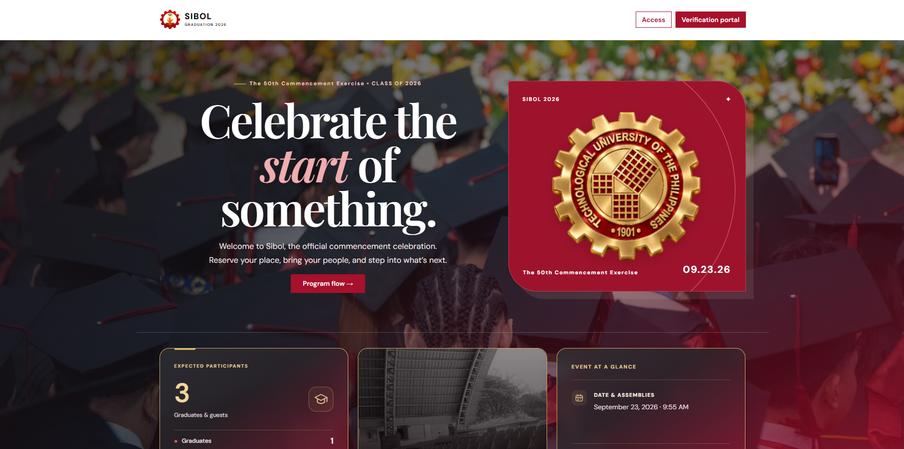

<div align="center">
  
  <h1>SIBOL</h1>
  <p><strong>A graduation portal built for the Technological University of the Philippines.</strong></p>
  <p>Ceremony management · Ticket reservations · QR admission · Mobile scanning</p>
  <p>
    
    
    
    <a href="LICENSE"></a>
  </p>
  <p><a href="#overview">Overview</a> · <a href="#features">Features</a> · <a href="#quick-start">Quick start</a> · <a href="#mobile-support">Mobile support</a> · <a href="#scanning-stations">Scanning stations</a></p>
</div>



<p align="center"><em>The Sibol website, featuring TUP branding, ceremony information, and graduation details.</em></p>

## Overview

Sibol was made for **TUP — the Technological University of the Philippines** to bring graduation information, attendee verification, ticket reservations, and admission records into one portal.

Students can verify their roster details, access their passes, and request tickets. Administrators manage ceremonies, student and faculty records, reservation approvals, and scanning stations. The interface works on **desktop, tablet, and mobile**, with a dedicated mobile reservation scanner.

## Features

| Area | What you can do |
| --- | --- |
| Graduation homepage | Present the campus, venue, ceremony schedule, countdown, and program flow. |
| Student verification | Register against the eligible student roster and sign in using an issued access code. |
| Ticket setup | Start ticket selling with a QR Ph payment image, or choose request approval only with an optional receipt upload. |
| Ticket policies | Set separate total ticket limits for students and faculty, including personal passes and pending requests. |
| Personal passes | Issue student passes automatically by default, or let verified students request a pass for admin approval. |
| Attendee portal | View QR tickets, reserve guest passes, accept eligible guest-ticket transfers, and print or save passes as PDF through the browser. |
| Administration | Manage ceremonies, attendees, program items, reservations, attendance totals, and ticket audits. |
| Ceremony history | Review completed ceremonies, rosters, tickets, and searchable entry/exit records. |
| Scanning stations | Validate reservations, record entry and exit, or use supported USB relay hardware for gate admission. |

## Quick start

You will need Python with `pip`. The application uses Django and a local SQLite database; the project has been tested with Python 3.11.

### 1. Clone the repository

```sh
git clone https://github.com/maeven-tapa/sibol_rvsp.git
cd sibol_rvsp
python -m venv .venv
```

Activate the virtual environment:

```powershell
# Windows PowerShell
.\.venv\Scripts\Activate.ps1
```

```sh
# macOS / Linux
source .venv/bin/activate
```

### 2. Install and initialize

```sh
python -m pip install -r requirements.txt
python manage.py migrate
python manage.py createsuperuser
python manage.py runserver
```

### 3. Open the portal

Open the [local homepage](http://127.0.0.1:8000/). Use [administrator sign-in](http://127.0.0.1:8000/admin-login/) with the superuser account you created.

| Page | Route |
| --- | --- |
| Homepage | `/` |
| Student verification | `/register/` |
| Student access-code sign-in | `/login/` |
| My tickets | `/tickets/` |
| Administrator sign-in | `/admin-login/` |
| Admin dashboard | `/dashboard/` |
| Ceremony history | `/history/` |
| Scanning station setup | `/gate/` |
| Django administration | `/admin/` |

## Running a ceremony

1. **Create a ceremony** in the dashboard and enter its campus, venue, schedule, and graduation details.
2. **Add attendees** to the student roster and faculty list, then prepare the program flow.
3. **Select Start ticket** in Ticket Audit and choose a reservation workflow:
   - **Ticket selling:** upload a QR Ph image. Guest reservations display that image and require a payment receipt.
   - **Request approval only:** no payment QR is displayed, and receipt uploads are optional.
4. **Configure ticket settings.** Student and faculty limits default to three total tickets per person. Automatic student-pass issuance is enabled by default; switch it off to require a personal-pass request.
5. **Review reservations.** Both workflows require administrator approval before a requested QR ticket is issued. QR Ph receipts are reviewed manually; the portal does not automatically verify payments.
6. **Open a scanning station** for validation or admission, and use the entry log to follow recorded activity.
7. **Complete the ceremony** to retain its records in History and prepare for the next ceremony.

## Mobile support

Sibol includes responsive layouts for the homepage, attendee portal, Dashboard, and History. Admin summary cards use a **2×2 grid on mobile**, with compact typography, wrapping controls, and horizontally scrollable data tables.

Mobile browsers use **Reservation check (Mobile)**. Other scanning modes are hidden, and the server enforces validation-only behavior so mobile scans cannot consume tickets or activate relays.

The mobile station:

- Opens in a new tab from station setup, with the entry log in the original tab.
- Starts the camera automatically after the browser grants permission.
- Prefers the rear-facing camera and supports manual ticket-code entry.
- Stops the camera when the page is hidden and resumes when it becomes visible.

Camera access requires **HTTPS**, except when using localhost on the same device. A phone accessing a computer through an ordinary HTTP LAN address will need manual code entry. Allow pop-ups for the station tab and camera access for scanning.

## Scanning stations

| Mode | Behavior | USB relay required? |
| --- | --- | --- |
| Gate entry | Admits a valid pass through its assigned gate. Student/faculty passes use Gate 1, guests use Gate 2, and admin passes activate both. Relay assignments can be swapped in setup. | Yes |
| In and out | First scan records entry; the second records exit. Each ticket permits one entry and one exit. | No |
| Reservation check | Checks a pass without consuming it or recording a gate admission. | No |
| Reservation check (Mobile) | Uses the dedicated mobile scanner for validation only. | No |

Desktop stations support a camera, a keyboard-emulating USB QR reader that sends Enter, or manual entry. Camera decoding uses jsQR from a CDN, so loading the scanner requires internet access.

### Optional gate hardware

Gate entry supports the KMtronic standard USB/VCP protocol with at least two relay channels: **9600 baud, 8 data bits, no parity, and 1 stop bit**. Connect the controller to the computer running Django and install its USB/VCP driver there.

Station setup checks port access without switching a relay. Admission claims are recorded before relay commands are sent. Failed or interrupted activations are held for inspection to prevent an automatic repeat pulse. Serial writes do not confirm the gate's physical position; verify the controller and physical gate before live use.

Automated hardware tests use mocks and do not establish compatibility with a particular physical installation.

## Project structure

```text
sibol_rvsp/
├── assets/                 # README and repository images
│   └── screenshot.png      # Website screenshot
├── events/                 # Models, views, forms, migrations, and tests
├── sibol_project/          # Django settings and root URLs
├── static/                 # CSS, JavaScript, branding, and images
├── templates/              # Pages, components, and mobile scanning template
├── media/                  # Runtime uploads: payment QR images and receipts
├── manage.py
└── requirements.txt
```

## Development

```sh
python manage.py check
python manage.py test
python manage.py makemigrations --check --dry-run
```

The test suite covers verification, ceremonies, ticket policies, reservation workflows, transfers, scanning modes, and relay failure handling. Browser camera permissions and physical gate operation should also be checked on the devices used for the event.

The bundled settings are for local development. Before hosting, configure a private secret key, disable debug mode, set allowed hosts, use HTTPS, and configure static/media serving and database backups. Use a production application server rather than Django's development server.

## Contributing

Bug reports and focused improvements are welcome. Describe the problem, include reproduction steps or screenshots where useful, and run the relevant checks before submitting a pull request.

## License

Licensed under the [Apache License 2.0](LICENSE).
